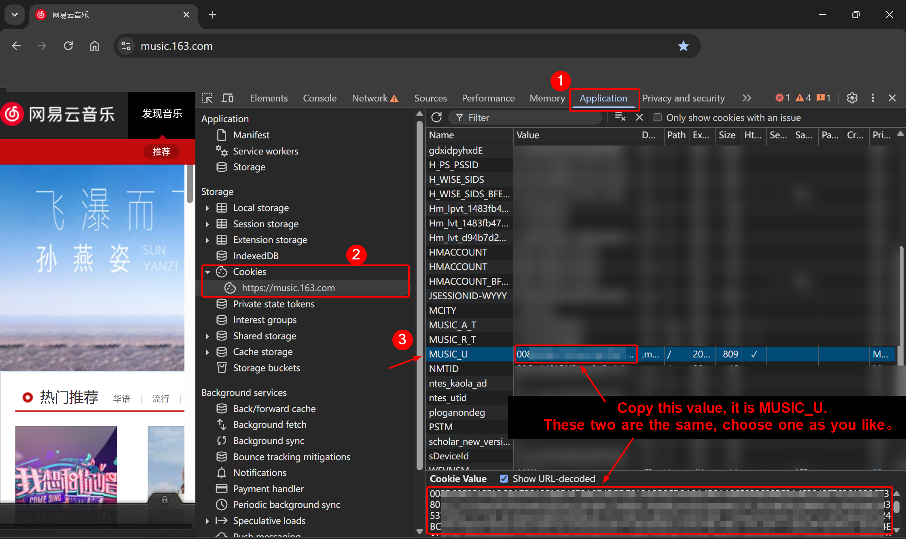

<h2>Methods to Obtain <code>MUSIC_U</code></h2>

**English** | [**中文简体**](get-MUSIC_U.md)

### Method 1 (Recommended)

1. In a desktop browser, go to the [Official NetEase Cloud Music website](https://music.163.com/) and log in.
2. Open the developer tools (usually `F12`; on some keyboards `Fn + F12`).
3. Navigate to `Application` → `Cookie` → `https://music.163.com`, locate the `MUSIC_U` entry, and copy its value.

#### Illustration

### Method 2

Use [qr_login.py](../qr_login.py) and scan the QR code with the NetEase Cloud Music mobile app to log in directly.

### Method 3

> The first two steps are the same as in Method 1; they are repeated here for clarity.
> This method is more cumbersome than Method 1, so it is not recommended and no screenshot is provided.

1. In a desktop browser, go to the [Official NetEase Cloud Music website](https://music.163.com/) and log in.
2. Open the developer tools (usually `F12`; on some keyboards `Fn + F12`).
3. Go to the `Network` tab → pick any request, and find the `MUSIC_U` parameter within it; copy its value.
