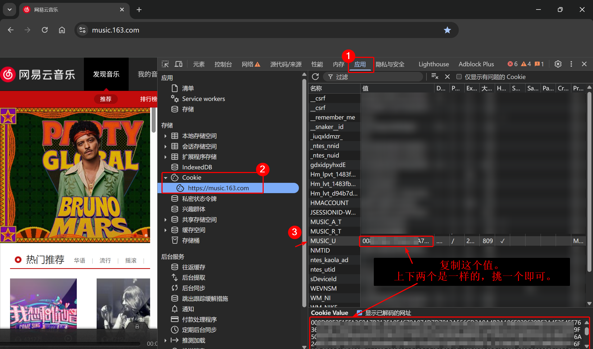

<h2>获取 <code>MUSIC_U</code> 的方法</h2>

**中文简体** | [**English**](get-MUSIC_U-EN.md)

### 方法一 （推荐）

1. 电脑端浏览器进入 [网易云音乐官网](https://music.163.com/)，登录。
2. 打开开发人员工具(Deveploer tools)，快捷键是 `F12` (有些电脑是 `Fn + F12` )。
3. 进入 `应用` -> `Cookie` -> `https://music.163.com`，找到 `MUSIC_U`，复制其值即可。

#### 示意图

### 方法二

使用 [qr_login.py](../qr_login.py)，直接用网易云手机客户端扫码登录。

### 方法三

> 前两步和方法一是一样的，这里再写一遍。
> 由于此方法较方法一繁琐，故不推荐，也不配图了。

1. 电脑端浏览器进入 [网易云音乐官网](https://music.163.com/)，登录。
2. 打开开发人员工具(Deveploer tools)，快捷键是 `F12` (有些电脑是 `Fn + F12` )。
3. 进入 `网络` -> 随便找一个请求，找到其中包含的 `MUSIC_U`，复制其值即可。
