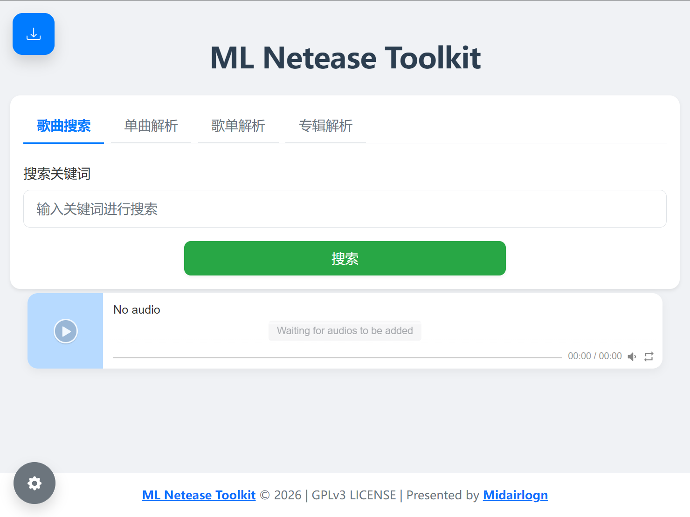
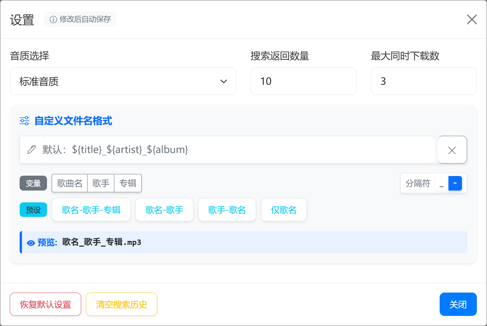
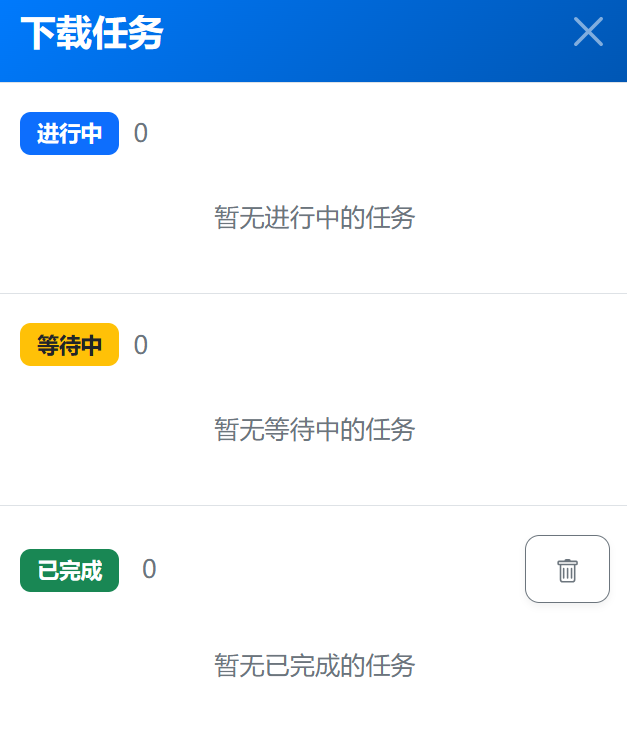

<div align="center">
<h1>ML-Netease_url</code></h1>
</div>

## 功能简介

本项目可解析网易云音乐，支持多种音质选择，支持 API 与命令行（GUI）两种模式。

同时，本项目提供下载功能，可以将歌曲信息（如歌手、封面、歌词等）写入音频元数据，支持批量下载、自定义下载的文件名格式。

此外，本项目还可以在线听歌哦。

### 优点
- [x] 优美的WebUI界面
- [x] 快速部署，支持多平台
- [x] 网页内存占用小(一般小于150MB)
- [x] 在线听歌体验良好，歌单加载速度快，使用预加载优化
- [x] 支持批量下载、自定义下载的文件名格式
- [x] 支持模糊搜索、输入联想记忆
- [x] 优雅的下载管理器、设置和通知界面
- [x] 控制台详细输出，便于开发、调试

<table>
  <tr>
    <td></td>
    <td></td>
    <td></td>
  </tr>
</table>

## 快速开始

### 1. 安装依赖

```bash
pip install -r requirements.txt
```

### 2. 配置环境变量

1. 复制示例环境变量文件：

```bash
cp .env.example .env
```

2. 修改 `.env` 文件，填入你的 `MUSIC_U` 值（黑胶会员账号 Cookie 中的 `MUSIC_U` 部分）：

```
MUSIC_U=your_music_u_value_here
```

> 关于 `MUSIC_U` 的获取，请参考 [获取 `MUSIC_U` 的方法](MUSIC_U/get-MUSIC_U.md).

3. 如有需要，修改 `.env` 中的其他配置项。

关键配置项：

- `MUSIC_U`：黑胶会员账号的 MUSIC_U 值
- `APP_HOST` / `APP_PORT`：应用监听地址和端口
- `ALLOWED_ORIGIN` / `ALLOWED_ORIGINS`：跨域白名单

### 3. 运行

#### GUI 模式

```bash
python main.py --mode gui --url <网易云音乐地址> --level <音质参数>
```

#### API 模式

默认端口为`6969`。

```bash
python main.py --mode api
```

在 windows 平台上可以直接去 `Release` 里面下载便携版，解压，按照要求加上 `cookie.txt` 文件，运行 `ml-launch-api.bat` 启动。

### 4. Linux 生产部署（Gunicorn + Nginx + systemd）

项目已提供基础生产部署工件：

- `wsgi.py`：Gunicorn 入口
- `deploy/gunicorn.conf.py`：Gunicorn 配置
- `deploy/ml-netease-url.service`：systemd service 示例
- `deploy/nginx.conf`：Nginx 反向代理示例
- `deploy/.env.example`：Linux 环境变量示例

#### 环境变量

推荐在 Linux 服务器上通过 systemd 的 `EnvironmentFile` 注入配置，例如：

```bash
cp deploy/.env.example /etc/ml-netease-url.env
```

关键配置项：

- `MUSIC_U`：黑胶会员账号的 MUSIC_U 值
- `APP_HOST` / `APP_PORT`：应用监听地址和端口
- `LOG_LEVEL`：日志级别，例如 `INFO`
- `ALLOWED_ORIGIN` / `ALLOWED_ORIGINS`：跨域白名单
- `GUNICORN_BIND` / `GUNICORN_WORKERS`：Gunicorn 绑定地址和 worker 配置

#### 启动 Gunicorn

```bash
python3 -m venv .venv
source .venv/bin/activate
pip install -r requirements.txt
gunicorn -c deploy/gunicorn.conf.py wsgi:app
```

默认建议由 Gunicorn 监听 `127.0.0.1:6969`，再由 Nginx 对外提供访问。

#### systemd 部署

将 `deploy/ml-netease-url.service` 安装到系统目录后执行：

```bash
sudo systemctl daemon-reload
sudo systemctl enable --now ml-netease-url
sudo systemctl status ml-netease-url
```

查看日志：

```bash
journalctl -u ml-netease-url -n 200
```

#### Nginx 部署

将 `deploy/nginx.conf` 放入站点配置目录后检查并重载：

```bash
sudo nginx -t
sudo systemctl reload nginx
```

#### 验证

部署完成后可验证：

- 首页 `/` 是否可正常访问
- 健康检查 `/health` 是否返回 `200`
- API `/Search`、`/Song_V1`、`/Playlist`、`/Album` 是否正常
- 确保 `MUSIC_U` 已正确配置

- 访问接口：http://ip:port/类型解析
- 支持 GET 和 POST 请求

## 参数说明

### GUI 模式参数

| 参数         | 说明                         |
| ------------ | ---------------------------- |
| --mode       | 启动模式：api 或 gui         |
| --url        | 需要解析的网易云音乐地址     |
| --level      | 音质参数（见下方音质说明）   |

### API 模式参数

| 参数         | 说明                                         |
| ------------ | -------------------------------------------- |
| url / ids    | 网易云音乐地址或歌曲ID（二选一）             |
| level        | 音质参数（见下方音质说明）                   |
| type         | 解析类型：json / down / text（三选一）       |

| 类型参数         | 说明                                         |
| ------------ | -------------------------------------------- |
| Song_v1    | 单曲解析             |
| search        | 搜索解析                   |
| playlist         | 歌单解析       |
| album         | 专辑解析       |

## 音质参数说明

- `standard`：标准音质
- `exhigh`：极高音质
- `lossless`：无损音质
- `hires`：Hi-Res音质
- `jyeffect`：高清环绕声
- `sky`：沉浸环绕声
- `jymaster`：超清母带

> 黑胶VIP音质：standard, exhigh, lossless, hires, jyeffect  
> 黑胶SVIP音质：sky, jymaster

## 注意事项

- 必须使用黑胶会员账号的 Cookie 才能解析高音质资源。
- Cookie 格式请严格按照 `cookie.txt.example` 示例填写。
- 浏览器控制台(console)有详细输出，可以供调试、开发使用。

## 免责声明

本工具仅供学习交流使用，请支持正版音乐。使用本工具时请遵守相关法律法规，尊重音乐人的劳动成果。

## 许可证

[GNU General Public License v3.0](LICENSE)

## 致谢和相关项目

- [Netease_url (Ravizhan)](https://github.com/Suxiaoqinx/Netease_url/)
- [ML-Netease_Android (Midairlogn)](https://github.com/midairlogn/ML-Netease_Android)

---

欢迎 Star、Fork 和 PR！