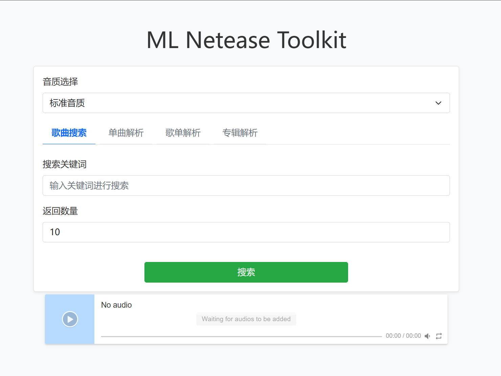

# ML-Netease_url

> **声明**  
> 本项目为开源软件，遵循 MIT 许可证。任何个人或组织均可自由使用、修改和分发本项目的源代码。但本项目及其任何衍生作品**禁止用于任何商业或付费项目**。如有违反，将视为对本项目许可证的侵犯。欢迎大家在遵守开源精神和许可证的前提下积极贡献和分享代码。

## dev 版说明

> dev 分支中重写，美化了前端

## dev 版运行语句

```bash
cd frontend
npm install
npx vite build
npm run dev
```

## 功能简介

本项目可解析网易云音乐，支持多种音质选择，支持 API 与命令行（GUI）两种模式。

同时，本项目提供下载功能，可以将歌曲信息（如歌手、封面、歌词等）写入音频的ID3标签。

此外，本项目还可以在线听歌哦。

### 优点
- [x] 优美的WebUI界面
- [x] 快速部署，支持多平台
- [x] 网页内存占用小(一般小于150MB)
- [x] 控制台详细输出，便于开发、调试



## 快速开始

### 1. 安装依赖

```bash
pip install -r requirements.txt
```

### 2. 配置 Cookie

请在 `cookie.txt` 文件中填入黑胶会员账号的 Cookie，格式如下：

```
MUSIC_U=`YOUR MUSIC_U`;os=pc;appver=8.9.75;
```

> 请参考 `cookie.txt.example` 示例，把`YOUR MUSIC_U`替换为你自己的即可（不保留``）。

### 3. 运行

#### GUI 模式

```bash
python main.py --mode gui --url <网易云音乐地址> --level <音质参数>
```

#### API 模式

默认端口为`6969`。

```bash
python main.py --mode api
```

在 windows 平台上可以直接去 `Release` 里面下载便携版，解压，按照要求加上 `cookie.txt` 文件，运行 `ml-launch-api.bat` 启动。

- 访问接口：http://ip:port/类型解析
- 支持 GET 和 POST 请求

## 参数说明

### GUI 模式参数

| 参数         | 说明                         |
| ------------ | ---------------------------- |
| --mode       | 启动模式：api 或 gui         |
| --url        | 需要解析的网易云音乐地址     |
| --level      | 音质参数（见下方音质说明）   |

### API 模式参数

| 参数         | 说明                                         |
| ------------ | -------------------------------------------- |
| url / ids    | 网易云音乐地址或歌曲ID（二选一）             |
| level        | 音质参数（见下方音质说明）                   |
| type         | 解析类型：json / down / text（三选一）       |

| 类型参数         | 说明                                         |
| ------------ | -------------------------------------------- |
| Song_v1    | 单曲解析             |
| search        | 搜索解析                   |
| playlist         | 歌单解析       |
| album         | 专辑解析       |

## 音质参数说明

- `standard`：标准音质
- `exhigh`：极高音质
- `lossless`：无损音质
- `hires`：Hi-Res音质
- `jyeffect`：高清环绕声
- `sky`：沉浸环绕声
- `jymaster`：超清母带

> 黑胶VIP音质：standard, exhigh, lossless, hires, jyeffect  
> 黑胶SVIP音质：sky, jymaster

## 注意事项

- 必须使用黑胶会员账号的 Cookie 才能解析高音质资源。
- Cookie 格式请严格按照 `cookie.txt.example` 示例填写。
- 浏览器控制台(console)有详细输出，可以供调试、开发使用。

## 致谢

- [Netease_url (Ravizhan)](https://github.com/Suxiaoqinx/Netease_url/)

---

欢迎 Star、Fork 和 PR！